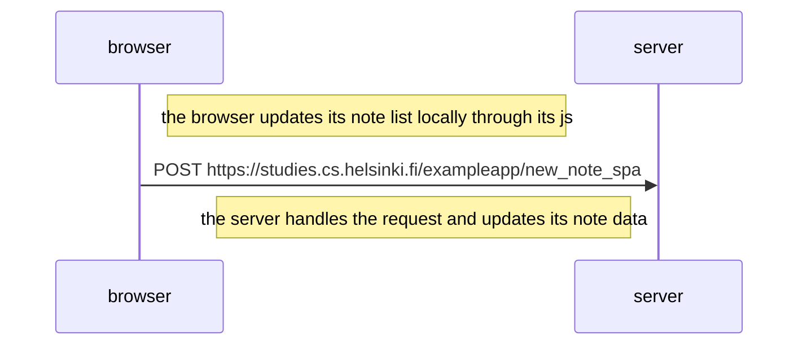

The diagram for ex0.6.

```mermaid
sequenceDiagram
    participant browser
    participant server

    Note right of browser: the browser updates its note list locally through its js
    browser->>server: POST https://studies.cs.helsinki.fi/exampleapp/new_note_spa
    activate server
    Note left of server: the server handles the request and updates its note data
```
